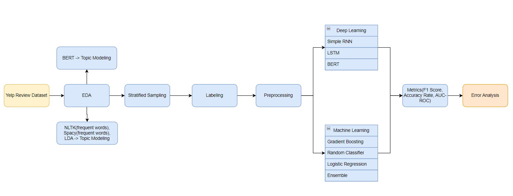

# Enhancing Business Insights On Yelp Reviews Through Aspect-Based Sentiment Analysis

This repo focuses on the Aspect-Based Sentiment Analysis of Yelp reviews, utilizing a combination of exploratory data analysis (EDA), machine learning, and deep learning models.


## Acknowledgements

 - [Yelp Open Dataset](https://www.yelp.com/dataset)
 - [Topic Modeling in Python: Latent Dirichlet Allocation (LDA)](https://towardsdatascience.com/end-to-end-topic-modeling-in-python-latent-dirichlet-allocation-lda-35ce4ed6b3e0)
 - [Aspect-Based Sentiment Analysis for Restaurant Reviews](https://www.youtube.com/watch?v=vHHpsd24Hyo)
 - [Aspect-Based-Sentiment-Analysis-on-Yelp-Reviews](https://github.com/georg670/Aspect-Based-Sentiment-Analysis-on-Yelp-Reviews)
 - [Exploratory Data Analysis and Data Mining on Yelp Restaurant Review](https://medium.com/@pooja.prasannan/exploratory-data-analysis-and-data-mining-on-yelp-restaurant-review-e0ce0eca7254)
 - [Eman Saeed Alamoudi & Norah Saleh Alghamdi (2021) Sentiment classification and aspect-based sentiment analysis on yelp reviews using deep learning and word embeddings, Journal of Decision Systems, 30:2-3, 259-281, DOI: 10.1080/12460125.2020.1864106](https://www.tandfonline.com/doi/citedby/10.1080/12460125.2020.1864106?scroll=top&needAccess=true)
    


## Road Map


## Usage

### Install the Libraries
To install the required libraries for your project, you can use the Python package manager, pip.

```python
pip install -r requirements.txt
```

### Labeling Guidline

For our project, we have meticulously labeled over 3,000 reviews. Detailed instructions and insights into the labeling process can be found in the document titled "Document Guidelines for Yelp Restaurant Data Annotation.pdf." This document provides comprehensive guidelines and information about the methodology used in the review labeling process, ensuring the accuracy and consistency of the labeled data for our project's objectives.

### Data
In the "data" folder, you'll find three important CSV files for your project:

- final_df_3040_labels.csv: This file contains manually labeled data, which serves as the ground truth or reference labels for your project.

- gpt_input_text.csv: You can find this file in the same folder. It contains the text data that was sent to the GPT API for labeling.

- gpt_output_labels.csv: This file contains the labels generated by the GPT model based on the input text.

### EDA
The raw data for this project can be accessed through the [Yelp Open Dataset](https://www.yelp.com/dataset). The [EDA_for_Presentation.ipynb](https://github.com/Text-Analytics-USC/Text_Analytics_Project/blob/main/EDA/EDA_for_Presentation.ipynb) notebook presents an exploratory data analysis based on a dataset consisting of 944894 users, 944894 businesses, and 944894 reviews . Our focus was on restaurant and bar reviews. The Exploratory Data Analysis (EDA) of restaurant reviews helped us to refine our aspect labeling guidelines.

For a more in-depth analysis, the yelp-review-eda-pyspark-databricks.ipynb notebook utilizes PySpark on Databricks and offers an interactive [EDA dashboard](https://databricks-prod-cloudfront.cloud.databricks.com/public/4027ec902e239c93eaaa8714f173bcfc/6503322215914925/4389308165354698/6822147173767959/latest.html)

Additionally, the Topic Modeling Visualization.ipynb notebook is used to visualize the results of LDA (Latent Dirichlet Allocation) topic modeling. The generated visualization is saved in the ldavis_prepared.html file.

Along with this, the BERT Topic Modelling verifies our topics from using LDA. The outputs from BERT topic modelling are in a file names topics.csv. 

### Modeling

MLmodels - Comparison.ipynb notebook, various vectorization methods and machine learning models are explored to identify the most suitable model for each aspect of the project. Hypothesis tests are conducted to compare the performance of these models, and the results are evaluated using F-1 metrics and AUC-ROC analysis.

DL Models.ipynb and BERTmodel.ipynb notebooks are utilized. These notebooks leverage RNN (Recurrent Neural Network), LSTM (Long Short-Term Memory), and BERT (Bidirectional Encoder Representations from Transformers) to create and assess models for the project's objectives.

### Benchmark with OpenAI

To benchmark our project, we employ OpenAI's GPT3.5 model for predictive tasks. The process involves two components:
- Connecting to OpenAI API: We use the gpt_api_labeling.py script to establish a connection to the OpenAI API, utilizing the GPT3.5 model for predictions. Please note that you'll need an OpenAI API key to run this script. Detailed instructions on obtaining an API key can be found in the [OpenAI API reference](https://platform.openai.com/docs/api-reference/introduction).

Evaluation: In the GPT Benchmark.ipynb notebook, we evaluate the results produced by the GPT model. This evaluation helps us assess the quality and effectiveness of the model's predictions in the context of our project. 

### Error Analysis

This section focuses on analyzing instances where model predictions were incorrect. The goal is to understand the characteristics of these misclassified instances, identify common patterns or features in these misclassifications, and gain insights into areas where the model might need improvement. It involves reviewing classification reports to assess precision, recall, and F1-score for each class, investigating imbalanced classes, and examining feature importance. Additionally, different models are compared to determine their performance and suitability for addressing specific aspects of the project.

To delve into the details of the error analysis, refer to the Error Analysis/MLmodels_error_analysis.ipynb
